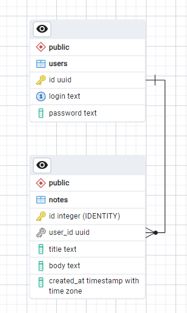

# Note-taker 

## Запуск проекта

Скопировать проект:
```bash
git clone https://github.com/kurochkinivan/Note-taker
cd Note-taker
```

В корневой директории проекта доступны две команды:
```bash
    ## Создать образ go-приложения, инициализировать БД с данными
    ## и go-приложение в одном контейнере (docker-compose).
    ## Может в первый раз выдать ошибку, необходимо перезапустить.
    make up

    ## Уничтожить контейнер, а также образ go-приложения.
    make rm
```

## Проверка эндпоинтов

Аунтетификация (возвращает jwt-токен):
```bash 
curl -X POST [::1]:8000/auth/sign-in \
    -H "Content-Type: application/json" \
    -d '{"login":"vanya", "password":"12345"}' 
```

Получение всех заметок, принадлежащих пользователю (**YOUR_TOKEN** заменить на выданный jwt-токен):
```bash
curl -X GET [::1]:8000/notes/all \
    -H "Authorization: Bearer YOUR_TOKEN" 
```

Добавление заметки (**YOUR_TOKEN** заменить на выданный jwt-токен):
```bash
curl -X POST [::1]:8000/notes/create \
    -H "Authorization: Bearer YOUR_TOKEN" \
    -H "Content-Type: application/json" \
    -d '{"title":"Моя первая заметка", "body":"Я ни умею песать па русски"}' 
```

## Использованные сторонние библиотеки

* sirupsen/logrus - логгирование;
* jackc/pgx - драйвер для PostgreSQL;
* golang-jwt/jwt - официальная библиотека для jwt-токенов;
* ilyakaznacheev/cleanenv - конфигурация приложения через yaml файл;
* Masterminds/squirrel - построитель sql-запросов (синтаксический сахар).

## Структура базы данных

База данных содержит две сущности: **users** и **notes**.


